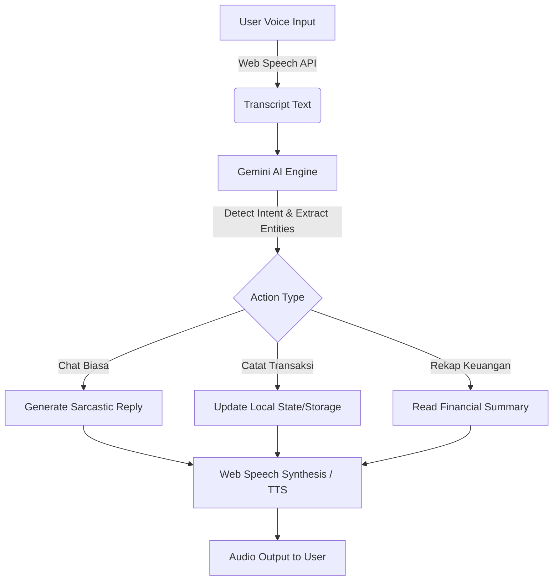

> ⚠️ **PERINGATAN KEAMANAN PENTING (SECURITY NOTICE)** ⚠️
> **JANGAN PERNAH** mempublikasikan atau meng-commit file `.env`, atau kode apapun yang berisi *hardcoded* API Keys (terutama `GEMINI_API_KEY`) ke repository publik seperti GitHub. File `.env` berisi kredensial rahasia rahasia yang akan menghabiskan kuota atau tagihan Anda jika disalahgunakan. Pastikan file `.env` selalu berada di dalam `.gitignore`. Hanya bagikan file `.env.example` sebagai referensi struktur variabel.

# Asep: AI Voice Assistant Keuangan (Gintoki Persona)


Asep adalah asisten keuangan pribadi cerdas berbantuan AI dengan *voice interface*, yang didesain memiliki kepribadian sarkas 100% Sakata Gintoki dari animasi Gintama. Catat pengeluaran dan pemasukan Anda hanya dengan ngobrol!

---

## 2. DEMO / SCREENSHOT

*(Ganti dengan path/URL gambar antarmuka chat dan dashboard keuangan yang asli)*


*(Ganti dengan link GIF demo saat Asep merekam suara dan menjawab)*


## 3. WHY THIS PROJECT EXISTS (Problem Statement)

**Masalah apa yang dipecahkan?**
Mencatat keuangan pribadi (pemasukan dan pengeluaran) seringkali membosankan dan terlupakan. Mengisi form pelacakan pengeluaran di aplikasi konvensional terasa kaku dan monoton. 

**Kenapa solusi yang sudah ada tidak cukup?**
Aplikasi pencatat keuangan lain membutuhkan input manual melalui *keyboard* dan navigasi UI yang berbelit, yang menurunkan *retention* pengguna.

**Siapa yang paling merasakan masalah ini?**
Orang-orang yang ingin berhemat, mengatur keuangan, tapi malas membuka aplikasi, mengetik, dan mengisi form laporan setiap kali selesai bertransaksi.

**Apa yang terjadi jika masalah ini tidak diselesaikan?**
Pengeluaran bocor halus tidak terdeteksi, tagihan menumpuk, dan pengguna kehilangan kendali atas uang mereka tanpa data yang jelas. Dengan Asep, Anda hanya perlu bilang "Sep, catat gue abis beli kopi 20 ribu," dan selesai. Plus, Anda akan disindir jika terlalu boros!

## 4. HOW IT WORKS (High-Level Architecture)



**Komponen Utama:**
1.  **Vite + React UI:** Bertanggung jawab atas render UI (chat area, sidebar, grafik PieChart pengeluaran).
2.  **Voice Manager (useSpeech):** Mengelola akses mikrofon menggunakan `window.SpeechRecognition` untuk merubah suara menjadi teks, dan `window.speechSynthesis` (TTS) untuk merubah balasan AI menjadi suara.
3.  **Gemini AI Service:** Berperan sebagai otak. Dengan *System Instruction* yang kuat (Gintoki persona), AI tidak hanya ngobrol, namun menggunakan *Function Calling* untuk mengenali kapan user menyebutkan angka/transaksi.
4.  **Local State Manager:** Mengelola transaksi harian dalam *memory* (atau `localStorage` jika diimplementasikan lebih jauh).

**Keputusan Teknis (Why):**
*   **Voice-First:** Mengurangi gesekan untuk mencatat.
*   **Gemini API:** Sangat pintar melakukan ekstraksi entitas dan memiliki fitur *Function Calling* yang *native*, sehingga teks obrolan bisa secara akurat diparsing menjadi data JSON (format pemasukan/pengeluaran).

## 5. KEY FEATURES

*   **🎙️ Obrolan Dua Arah Berbasis Suara (Voice to Voice)**  
    Ngobrol dengan AI tanpa perlu mengetik. Berguna saat sedang di jalan atau tangan kotor, tinggal sebut pengeluaran Anda.
*   **🤖 Kepribadian Tsundere / Sarkas (Gintoki Style)**  
    Memberikan sentuhan *fun* dan personal. AI akan memarahi Anda jika tidak ada saldo, dan minta "Extra Joss" sebagai upah. Menghilangkan rasa bosan saat me-review finansial.
*   **📊 Deteksi Transaksi Otomatis (Function Calling)**  
    Cukup katakan "Gaji bulan ini masuk 5 juta", AI otomatis mengekstrak Nominal (5.000.000), Tipe (Pemasukan), dan Deskripsi tanpa Anda harus menekan tombol apapun.
*   **📈 Dashboard Laporan Instan & Pie Chart**  
    Tampilan finansial *real-time* berbasis komponen Chart dari basis data yang direkam oleh AI.
*   **⬇️ Export to Excel**  
    Data fleksibel. Data yang tersimpan mudah untuk didownload ke versi Excel untuk keperluan lain.

## 6. QUICK START (< 5 menit bisa jalan)

**Prerequisites:** 
- Node.js versi 18 atau lebih baru.
- Token API dari Google AI Studio.

**Instalasi & Menjalankan:**
```bash
# 1. Clone repository (jika dari git) atau ekstrak ZIP
# git clone <repo_url>
# cd asep-finance-ai

# 2. Setup dependency
npm install

# 3. Setup Environment Variables
# Copy file contoh konfigurasi lalu masukkan API Key Anda
cp .env.example .env

# Di dalam file .env, isi VITE_GEMINI_API_KEY dengan API Key dari Google AI Studio
# VITE_GEMINI_API_KEY="AIzaSyD-xxx..."

# 4. Jalankan Development Server
npm run dev
```

**Verifikasi:**
Buka `http://localhost:3000` atau URL yang diberikan oleh Vite di terminal. Anda harus melihat UI aplikasi, dan Anda bisa mengklik tombol Mikrofon untuk mulai mengobrol.

## 7. INSTALLATION (Detail Lengkap)

*   **Development Setup (Local Emulator):**
    Lakukan instruksi *Quick Start* di atas. Pastikan Browser yang Anda gunakan mendukung fitur Web Speech API (disarankan Google Chrome). 
    *Troubleshooting umum:* Jika UI hanya tampil putih (Blank Screen), pastikan dependensi telah sukses diinstall (pastikan Anda sudah `npm install`) dan API key di `.env` sudah terisi dengan valid tanpa spasi ekstra atau kutip ganda yang salah format.
*   **Production Setup:**
    ```bash
    npm run build
    npm run preview # Untuk testing build secara mandiri sebelum meluncurkan ke hosting provider
    ```
    Folder `/dist` siap dipublish ke hosting statis seperti Vercel, Netlify, atau Firebase Hosting.

## 8. CONFIGURATION

Variabel *Environment* (terdapat di file `.env`):

*   `VITE_GEMINI_API_KEY`
    *   **Tipe:** String.
    *   **Deskripsi:** API Key utama agar otak Gemini AI dapat berjalan. Jika variabel ini tidak disetel, aplikasi akan menghasilkan error internal dan pop-up protes dari Asep yang meminta API Keys (seluruh UI mungkin tetap terbaca).
    *   **Kapan mengubah:** Ketika limit project trial habis dan memakai key dari project cloud berbayar.
    *   **Contoh Nilai:** `AIzaSyXXXXXXXXXXXXXXX`

## 9. USAGE (Cara Pakai Lengkap)

**Use Case 1: Mencatat Pengeluaran**
Cukup klik *mic*, lalu ucapkan: 
> "Sep, gue abis beli sate kambing 40 ribu nih, catet dong bray."

*Sistem AI akan merespons (via text dan TTS):* "Nih udah gue catat buat sate kambing 40 ribu. Saldo lo sisa dikit tuh, sok-sokan makan mewah, mending sisain buat beliin gue minuman napa." *(Otomatis masuk ke Laporan Keuangan).*

**Use Case 2: Minta Rekapitulasi**
Klik *mic* lalu ucapkan:
> "Saldo bulan ini sisa berapa?"ATAU "Minta laporan keuangan."

Asep akan membacakan rangkuman total Saldo, Pemasukan, dan Pengeluaran, serta menyebut apakah status keuangan Anda *"AMAN"*, *"TIPIS"*, atau *"UDAH BANGKRUT"*.

**Batasan (Edge Cases):**
*   **Browser tidak support SpeechRecognition:** Aplikasi masih menyediakan kolom input text untuk Anda mengetik secara manual di bagian bawah chat area.

## 10. ARCHITECTURE & DESIGN DECISIONS

*   **Vite + React:** Dipilih karena kecepatannya (HMR build tinggi), arsitektur SPA yang nyaman, dan kompabilitas penuh bagi TailwindCSS.
*   **Google Gemini AI:** 
    *   *Kenapa Gemini?* Gratis untuk limit tertentu (AI Studio), sangat cepat, pandai mengerti bahasa non-baku Indonesia (Slang/Informal), serta dukungan kuat untuk *Tool/Function Calling*. Open source lokal LLM terlalu berat di-host mandiri, sementara produk OpenAI seringkali berbayar untuk penggunaan fungsi spesifik secara masif.
    *   *Trade-off:* Aplikasi bergantung kuat pada koneksi internet. Jika API Google tewas, otak aplikasi mati seketika. Sistem akan memberi respons cadangan darurat (error text).
*   **Struktur Folder:**
    *   `/src/components`: UI modular (ChatArea, Sidebar, FinancePanel, BillsView).
    *   `/src/hooks`: Custom hooks (seperti `useSpeech.ts` khusus menghandle *nasty syntax* Web Speech API yang sering error timeout, diakali dengan custom `timeoutRef`).
    *   `/src/services`: Konektor eksternal (Inisiasi model Gemini `ai.ts`).
    *   `/src/store`: State global sederhana jika dibutuhkan.

## 11. TESTING

*N/A untuk project ini karena saat ini dirancang pada fase PoC (Proof of Concept) / Prototype cepat tanpa Test Suits yang ditulis.*

Ke depannya, disarankan menggunakan **Vitest** dan **React Testing Library** pada komponen `FinancePanel` untuk memvalidasi algoritma format uang (mata uang IDR) dan perhitungan saldo bersih secara *automated* tanpa menyentuh layer API.

## 12. PERFORMANCE

**Bottleneck Utama:** 
Penundaan waktu ketika memanggil Gemini API. Karena aplikasi membaca respons dan menunggu AI mengklasifikasi apakah teks membutuhkan aksi (Function Call) baru membalas, pengguna harus memaklumi latensi (delay) ~1—2.5 detik sesudah bicara sebelum karakter Asep membalas dan bersuara. 

*Perbaikan:* Web Speech TTS (`window.speechSynthesis`) diusahakan tereksekusi segera sesudah blok dari Promise API *resolved* sepenuhnya agar ucapan suara berjalan stabil secara async tanpa memblok frame rendering di UI React.

## 13. SECURITY

**Pertimbangan Keamanan:**
*   Project ini adalah aplikasi "Client-Side" SPA menggunakan React. Mengekspos rahasia `GEMINI_API_KEY` menggunakan awalan `VITE_` berarti *Key tersebut ter-compile dan bisa dibaca secara teoretis dari inspeksi berkas Java-Script pada public network.*
*   **Limitasi & Risiko Jangka Panjang:** Aplikasi ini cocok dipasang secara lokal (di PC sendiri via localhost) oleh individual. JANGAN deploy ke domain publik (Internet) bila memakai API KEY dari tagihan kartu kredit Anda tanpa pembungkus layer Server (Backend/Proxy/BFF) untuk menyembunyikan API key, sebab siapapun bisa *scrape* API milik Anda di public.

## 14. CONTRIBUTING

Kontribusi sangat kami harapkan untuk membuat Asep makin pintar, akurat mencatat, atau mungkin makin menjengkelkan ketika bicara!

1.  Fork repo ini.
2.  Bikin branch fitur baru (`git checkout -b fitur/TambahExportPDF`).
3.  Tulis kode Anda (ikuti convention Prettier standar).
4.  Commit perubahan (`git commit -m 'feat: nambah export PDF'`).
5.  Push ke branch tersebut, dan buat Pull Request.

Issue yang dibutuhkan saat ini: Implementasi Backend / Database persisten seperti Firebase / SQLite lokal dibandingkan menyimpan array secara sementara.

## 15. ROADMAP

*   **[In Progress]** Refinements UI/UX dan animasi (Framer Motion)
*   **[Planned]** Menyambungkan ke database Firebase Firestore / IndexedDB supaya riwayat chat tidak hilang ketika browser di-*refresh*.
*   **[Planned]** Pilihan model suara TTS yang beragam via integrasi Text-to-Speech API (seperti ElevenLabs/Google Cloud TTS) daripada bergantung pada bot system default Windows/Mac.
*   **[Won't Do]** Membuat sistem User Authentication berlapis-lapis dan mode perusahaan/B2B kompleks. *Asep ditujukan khusus sebagai aplikasi pencatat pribadi yang casual dan langsung masuk tanpa banyak halaman setting (login-free utility).*

## 16. FAQ

**Q: Saya install ini dan jalankan perintah `npm start` tapi gak jalan?**
A: Karena ini Vite. Perintah utamanya adalah `npm run dev`. File konfigurasi default untuk *serving* development pada React-Vite berbeda dengan Create-React-App konvensional.

**Q: Pas ngomong pakai Mic, kok responnya lama/seolah-olah saya belum ditanggapi?**
A: Browser kadang memotong sesi bicara jika ada hening singkat. Hook kami otomatis mendeteksi hening 3.5 detik (Auto-stop) dan di-handle ke API. Harap bicara secara natural tanpa jeda yang amat terlampau panjang, atau ketik langsung jika ragu.

**Q: API Error / Quota Exhausted selalu muncul.**
A: Hal ini menandakan Token/API Key yang Anda setel di `.env` (dari Google AI Studio) sudah melewati pemakaian *Rate Limit* karena API gratisan memiliki batas Request per Menit yang terbatas. Coba lagi dalam beberapa saat atau *upgrade* plan.

**Q: Kenapa gak pakai Backend Node.js / Python saja?**
A: Keputusan merancang rilis pertama via web client browser ini karena ini PoC eksperimental. Untuk menjaga *deployment* sangat *simpel* sehingga orang awam dapat langsung pull kodenya ke komputer mereka dan tak perlu setup service/daemon di database, semuanya berjalan secara In-Memory.

**Q: Kenapa pakai Tailwind tidak SCSS/CSS murni?**
A: TailwindCSS digunakan agar penulisan arsitektur komponen sangat cepat dengan ukuran bundle minimal, serta menjaga keseragaman warna (`slate-900`, `blue-500`) tanpa capek merancang palet hex manual.

## 17. TROUBLESHOOTING

1.  **Error:** `Woi Bos! API Key lo bodong atau belum di-set tuh!` 
    *Penyebab:* Variabel `VITE_GEMINI_API_KEY` belum terdeteksi. 
    *Solusi:* Buat file `.env` di direktori terdepan (samping package.json). Isilah dengan instruksi di bab Quick Start. Restart terminal/Vite dengan matikan lalu nyalakan lagi (*hot-reload tidak memuat ulang env baru*).

2.  **Error:** `Speech recognition error: not-allowed`
    *Penyebab:* Browser memblokir akses *Microphone*.
    *Solusi:* Cek icon *Gembok/Lock* di pojok bar link URL browser dekat URL (localhost:3000), pastikan izin untuk "Microphone" bernilai Allowed.

3.  **Error:** Web memuat Blank Page Putih, Tab Tertulis "My google AI Studio App".
    *Penyebab:* Ada instalasi dependensi esensial yang bentrok atau syntax yang rusak di `App.tsx` (seperti Type error ketika modifikasi).
    *Solusi:* Buka Console Developer (F12 di browser) dan lihat log garis merah *Error* utama, serta pastikan tidak ada cache module lama dengan cara hapus folder `node_modules` dan instal ulang melalui `npm install`.

## 18. CHANGELOG

*   **v1.0.0** — [Minggu Ke-2, Mei 2026]: Initial Release of Asep.
    *   Pengaturan LLM ke model Gemini teranyar dengan integrasi deklarasi function *update_excel_finance* & *get_summary*.
    *   Refactoring kepribadian prompt "Extra Joss" sesuai revisi persona 100% Gintoki.
    *   Pengembangan UI panel Keuangan, Obrolan (mengatasi masalah flexbox z-index tertimpa mic), dan integrasi Laporan Penuh + PieChart.
    *   Peningkatan logika Auto-stop microphone jika senyap selama 3.5 detik atau timeout idle 6 detik awal.
    *   Handled Error Code 429 Limit Rate.

## 19. LICENSE & CREDITS

**Lisensi:** MIT License — Lakukan apapapun yang Anda mau dengan source code ini. Gunakan, duplikasi, edit, deploy. Anda memegang kebebasan tanggung jawab sendiri.

**Credits:** 
*   **Google Gemini API:** Mesin utama otak.
*   **Lucide-React:** Koleksi Ikon SVG.
*   **Recharts:** Diagram visual grafik bundar keuangan.
*   **Vite & React Community.** 
*   Inspirasi Persona dari Gintama (Hideaki Sorachi) — semua hak karakter / sifat berada di properti milik pemilik resminya.
